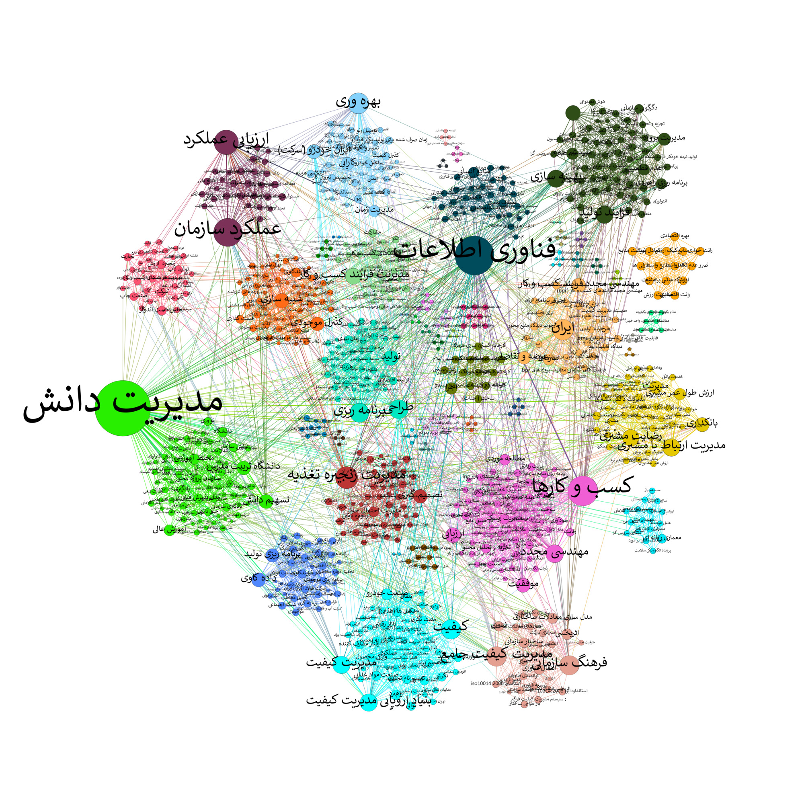

<div align="center">
  <p>
    <a align="center" href="" target="_blank">
      
    </a>
  </p>
  <br>

  <div align="center">
      <a href="https://github.com/tekboart/">
          
      </a>&nbsp;&nbsp;&nbsp;
      <a href="https://www.linkedin.com/in/kyan-bhr/">
          
      </a>&nbsp;&nbsp;&nbsp;
      <a href="https://scholar.google.com/citations?user=r3xmjQUAAAAJ&hl=en">
          
      </a>&nbsp;&nbsp;&nbsp;
      <a href="https://www.kaggle.com/tekboart">
          
      </a>&nbsp;&nbsp;&nbsp;
  </div>
</div>

<hr height="10">

# Web Scraping and Social Network Analysis (SNA) to analyze the research interst(s) of arbitrary Iranian university professors


This repository contains the code (and a sample of data) of a research project in the field of Social Network Analysis (SNA). We used `requests` module (in Python) to scrape the information of theses, supervised by a certain university professor, then use SNA to analyze different aspects of research done by that professor.

This research encompasses several steps as follows:
1. Scraping the information of a professor from [irandoc](irandoc.ir).
1. Conducting Exploratory Data Analysis (EDA) on the crawled data.
1. Cleaning the data.
    > e.g., cleaning: the kewords and titles, unsupported characters, duplicate records, etc.
1. Converting data into an Adjacency matrix.
1. Converting the Adjacency matrix into a graph (using igraph).
1. Analyzing and visualizing the network by calculating different centrality measures.
1. Doing community detection (CD) to clustering theses into similar groups.
    > CD methods: i.e., Label Propagation, Eigenvector, Infomap, and Components

## Requirements


<!-- - Please refer to the file `requirements.txt` for a comprehesive list of packages and their corresponding version. -->

## Project Dir Structure
```bash
.
├── data
├── images
│   └── logos
├── logs
├── outputs
│   ├── csv
│   ├── json
│   └── plots
│       ├── 1. networks visualization
│       ├── 2. network with centrality measures
│       └── 3. community detection visualization
│           └── gephi
├── reports
└── utils

14 directories

```

<!-- ## Data

## Contact
<!-- Unfortunately this repo is no longer actively maintained.  -->
If you have any questions, feel free to contact TekBoArt @tekboart.

## License
<!-- Creative Common Licenses -->
<!-- "Creative Commons Attribution-NonCommercial-ShareAlike (CC-BY-NC-SA)" -->
Shield: [![CC BY-NC-SA 4.0][cc-by-nc-sa-shield]][cc-by-nc-sa]

<!-- MIT License (can be used commercially) -->
<!-- Shield: [](https://opensource.org/licenses/MIT) -->

- Refer to the file `LICENSE` for more information regarding the license of this repository.

This work is licensed under a
[Creative Commons Attribution-NonCommercial-ShareAlike 4.0 International License][cc-by-nc-sa].

[![CC BY-NC-SA 4.0][cc-by-nc-sa-image]][cc-by-nc-sa]

[cc-by-nc-sa]: http://creativecommons.org/licenses/by-nc-sa/4.0/
[cc-by-nc-sa-image]: https://licensebuttons.net/l/by-nc-sa/4.0/88x31.png
[cc-by-nc-sa-shield]: https://img.shields.io/badge/License-CC%20BY--NC--SA%204.0-lightgrey.svg


